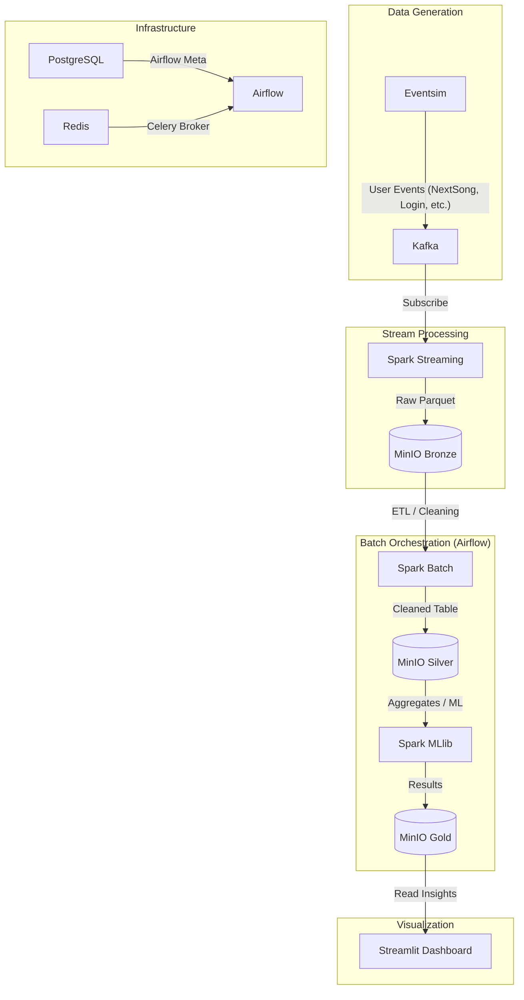

# 🎵 Streamlify: Real-time Music Data Pipeline

**Streamlify** là một nền tảng Data Engineering hiện đại, xử lý dữ liệu streaming thời gian thực dựa trên hành vi người dùng (tương tự Spotify). Dự án áp dụng kiến trúc **Medallion Architecture** (Bronze, Silver, Gold) để xây dựng một luồng dữ liệu tin cậy, từ việc thu thập sự kiện thô đến việc cung cấp các mô hình Machine Learning như Gợi ý nhạc (ALS) và Dự báo rời bỏ (Churn Prediction).

---

## 🏗️ Kiến trúc Hệ thống (Architecture)

Hệ thống được thiết kế theo mô hình phân tán, sử dụng các công nghệ hàng đầu trong hệ sinh thái Big Data:



---

## 🛠️ Công nghệ Sử dụng (Tech Stack)

| Thành phần | Công nghệ | Chi tiết |
| :--- | :--- | :--- |
| **Data Source** | `Eventsim` | Trình giả lập hành vi người dùng Spotify thời gian thực. |
| **Streaming Broker** | `Apache Kafka` | Lưu trữ sự kiện theo mô hình KRaft (không cần Zookeeper). |
| **Processing Engine** | `Apache Spark` | Chạy cả Streaming (Kafka ingestion) và Batch (ETL, ML). |
| **Storage (Data Lake)** | `MinIO` | Lưu trữ hướng đối tượng (S3-compatible) với 3 Layer: Bronze, Silver, Gold. |
| **Orchestration** | `Apache Airflow` | Điều phối các luồng Batch Job qua Celery Executor. |
| **Dashboard** | `Streamlit` | Giao diện Premium theo dõi Live Stream, Churn Risk và Recommendations. |
| **Infrastructure** | `Docker`, `Terraform` | Quản lý container và khởi tạo Buckets tự động. |

---

## 📁 Cấu trúc Thư mục (Project Structure)

```text
streamlify/
├── containers/             # Cấu hình Docker & Environment
│   ├── airflow/            # Custom Airflow Image (Pre-baked providers)
│   ├── spark/              # Custom Spark Image (Pre-baked JARs)
│   ├── dashboard/          # Streamlit UI Image
│   ├── eventsim/           # Data Generator
│   ├── .env                # Biến môi trường (Local)
│   ├── .env.example        # Mẫu biến môi trường
│   └── docker-compose.yml  # File khởi chạy toàn bộ stack
├── src/                    # Mã nguồn logic
│   ├── dags/               # Airflow DAGs (Orchestration)
│   ├── jobs/               # Spark Jobs logic
│   │   ├── streaming/      # Kafka to MinIO Bronze
│   │   └── batch/          # Silver & Gold processing, ML training
│   └── dashboard/          # Streamlit UI code (app.py)
├── infrastructure/         # Terraform Scripts (Tạo buckets)
├── data/                   # Local storage cho Docker volumes (Ignored)
└── README.md               # Tài liệu dự án
```

---

## 🚀 Luồng dữ liệu (Data Pipeline Flow)

1.  **Bronze Layer**: Spark Streaming đọc liên tục từ Kafka và ghi dữ liệu thô vào `s3a://bronze-zone/`.
2.  **Silver Layer**: Airflow kích hoạt Spark Batch Job để làm sạch dữ liệu (xử lý null, chuẩn hóa timestamp) và lưu vào `s3a://silver-zone/`.
3.  **Gold Layer**:
    *   **Song Rankings**: Thống kê top bài hát theo khung giờ.
    *   **ALS Model**: Huấn luyện Collaborative Filtering để gợi ý bài hát cho từng User.
    *   **Churn Model**: Sử dụng GBT/XGBoost để dự đoán người dùng có khả năng rời bỏ dịch vụ.
    *   Dữ liệu cuối cùng lưu tại `s3a://gold-zone/`.
4.  **Analytics**: Dashboard đọc dữ liệu từ Gold Layer để hiển thị các Insights kinh doanh quan trọng.

---

## 🔧 Hướng dẫn Cài đặt

1.  **Chuẩn bị**:
    *   Copy file `.env.example` thành `.env` và điền các thông tin cần thiết.
    *   Đảm bảo Docker & Docker Compose đã được cài đặt.

2.  **Khởi động Stack**:
    ```bash
    cd containers
    docker-compose up -d --build
    ```

3.  **Khởi tạo Infrastructure (Buckets)**:
    ```bash
    cd infrastructure
    terraform init
    terraform apply
    ```

4.  **Truy cập**:
    *   **Airflow**: `http://localhost:8888` (homura_madoka / homura123)
    *   **Dashboard**: `http://localhost:8501`
    *   **Kafka UI**: `http://localhost:8081`
    *   **MinIO Console**: `http://localhost:9001` (homura_madoka / homura123)

---
*Phát triển bởi **Antigravity**.*
